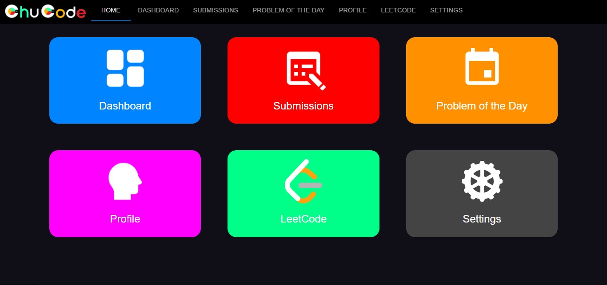

# ChuCode
LeetCode Companion App - Leetcode Trainer - Coding Interview Prep Simplified
### Skills
* MongoDB
* Express JS
* React JS
* Node JS
* CSS
* HTML
## Home

### To-Do
- [x] Connected database to frontend
- [x] Connected main routes/pages
- [x] Created Home page
- [ ] Create dashboard
- [ ] Update/delete in submissions
- [ ] Make graphs and charts
- [ ] User account sign-in
- [ ] Gauges for readiness on dashboard
- [ ] Make it look good
